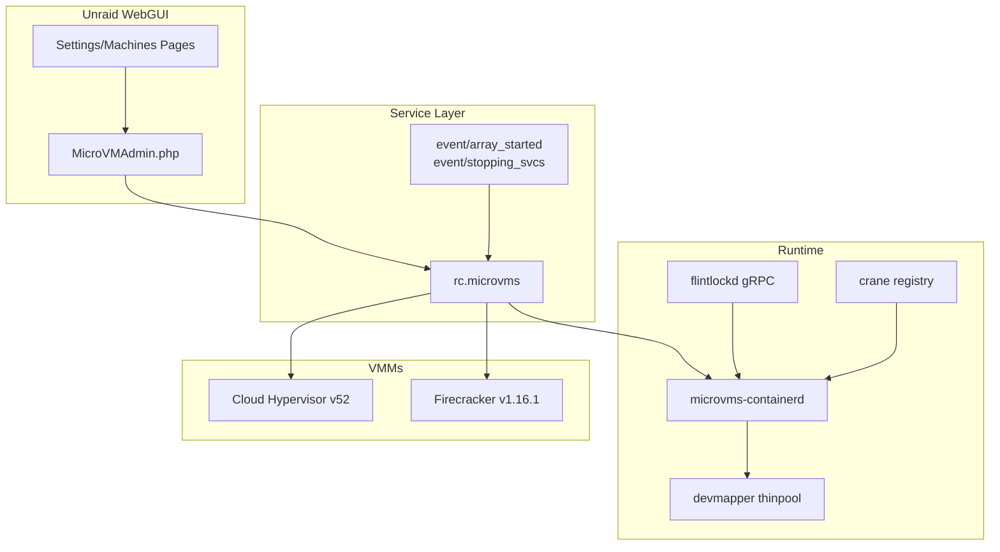
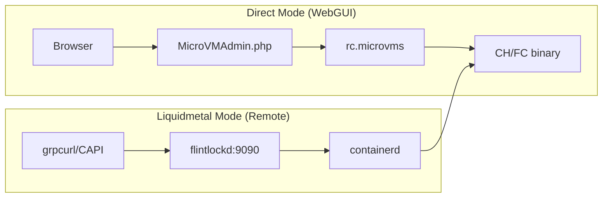
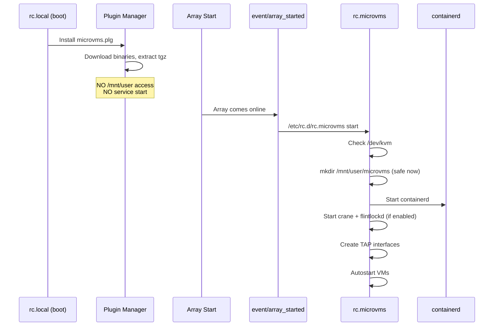
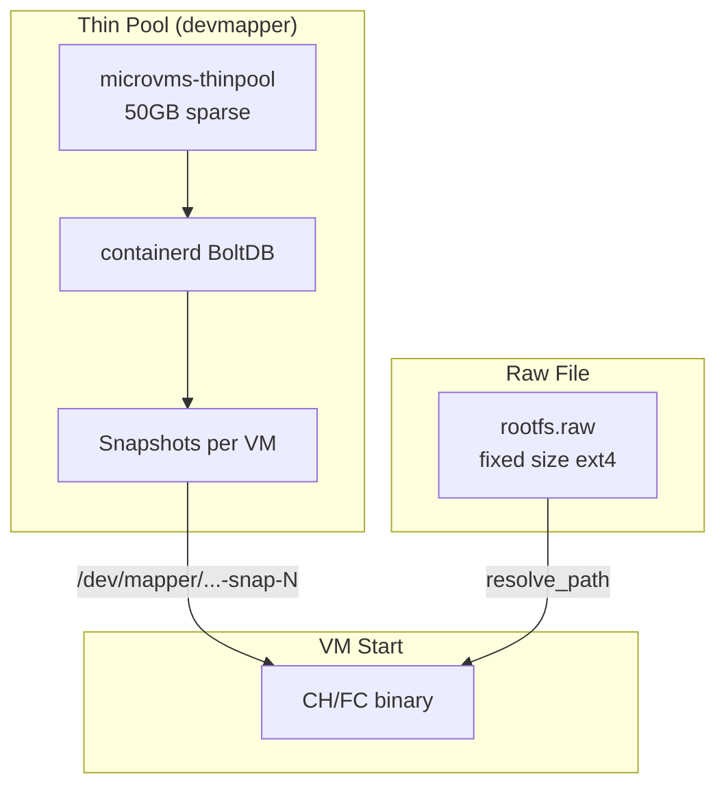
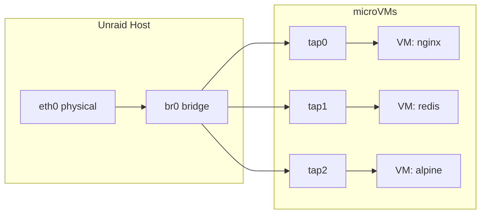

# Architecture

## System Overview

```mermaid
graph TB
    subgraph "Unraid WebGUI"
        UI[Settings/Machines Pages]
        AJAX[MicroVMAdmin.php]
    end
    
    subgraph "Service Layer"
        RC[rc.microvms]
        EVENTS[event/array_started<br>event/stopping_svcs]
    end
    
    subgraph "Runtime"
        CTD[microvms-containerd]
        DM[devmapper thinpool]
        CRANE[crane registry]
        FL[flintlockd gRPC]
    end
    
    subgraph "VMMs"
        CH[Cloud Hypervisor v52]
        FC[Firecracker v1.16.1]
    end
    
    UI --> AJAX
    AJAX --> RC
    EVENTS --> RC
    RC --> CTD
    RC --> CH
    RC --> FC
    CTD --> DM
    FL --> CTD
    CRANE --> CTD
```

## Two Operating Modes

```mermaid
graph LR
    subgraph "Direct Mode (WebGUI)"
        A[Browser] --> B[MicroVMAdmin.php]
        B --> C[rc.microvms]
        C --> D[CH/FC binary]
    end
    
    subgraph "Liquidmetal Mode (Remote)"
        E[grpcurl/CAPI] --> F[flintlockd:9090]
        F --> G[containerd]
        G --> D
    end
```

## Boot Sequence

```mermaid
sequenceDiagram
    participant Boot as rc.local (boot)
    participant PLG as Plugin Manager
    participant Array as Array Start
    participant Event as event/array_started
    participant RC as rc.microvms
    participant CTD as containerd
    
    Boot->>PLG: Install microvms.plg
    PLG->>PLG: Download binaries, extract tgz
    Note over PLG: NO /mnt/user access<br>NO service start
    
    Array->>Event: Array comes online
    Event->>RC: /etc/rc.d/rc.microvms start
    RC->>RC: Check /dev/kvm
    RC->>RC: mkdir /mnt/user/microvms (safe now)
    RC->>CTD: Start containerd
    RC->>RC: Start crane + flintlockd (if enabled)
    RC->>RC: Create TAP interfaces
    RC->>RC: Autostart VMs
```

## Storage Architecture

```mermaid
graph TB
    subgraph "Thin Pool (devmapper)"
        TP[microvms-thinpool<br>50GB sparse]
        CTD2[containerd BoltDB]
        SNAP[Snapshots per VM]
        TP --> CTD2
        CTD2 --> SNAP
    end
    
    subgraph "Raw File"
        RAW[rootfs.raw<br>fixed size ext4]
    end
    
    subgraph "VM Start"
        VM[CH/FC binary]
    end
    
    SNAP --> |/dev/mapper/...-snap-N| VM
    RAW --> |resolve_path| VM
```

## Network Architecture

```mermaid
graph LR
    subgraph "Unraid Host"
        BR0[br0 bridge]
        ETH[eth0 physical]
    end
    
    subgraph "microVMs"
        TAP0[tap0] --> VM1[VM: nginx]
        TAP1[tap1] --> VM2[VM: redis]
        TAP2[tap2] --> VM3[VM: alpine]
    end
    
    ETH --> BR0
    BR0 --> TAP0
    BR0 --> TAP1
    BR0 --> TAP2
```
