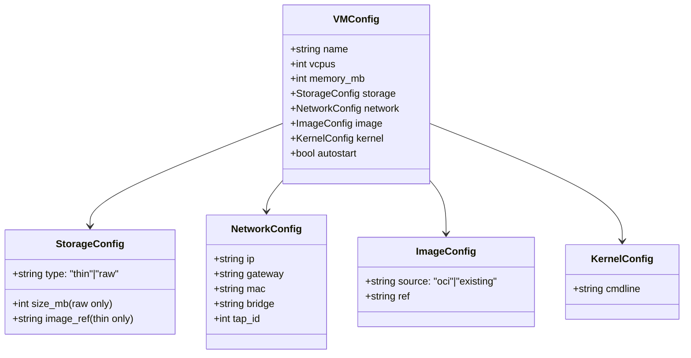

# Data Models

## VM Config (cloud-hypervisor.json / firecracker.json)

## Controlplane Config (microvms.controlplane.cfg)

INI format key-value pairs:
| Key | Type | Default | Description |
|-----|------|---------|-------------|
| SERVICE | enable/disable | enable | Master switch |
| VMDIR | path | /mnt/user/microvms | VM data directory |
| BRIDGE | string | br0 | Network bridge |
| DEFAULT_CPUS | int | 1 | Default vCPUs |
| DEFAULT_MEMORY | int | 256 | Default memory (MB) |
| DEFAULT_VMM | string | cloud-hypervisor | Default VMM |
| AUTOSTART | yes/no | no | Auto-start on array start |
| THINPOOL_DATA_SIZE_GB | int | 50 | Thin pool size |
| DEVMAPPER | enable/disable | enable | Thin pool toggle |
| CH_ENABLED | yes/no | yes | Cloud Hypervisor toggle |
| FC_ENABLED | yes/no | no | Firecracker toggle |
| FLINTLOCKD | enable/disable | disable | Liquidmetal toggle |
| FLINTLOCKD_GRPC_PORT | int | 9090 | gRPC port |
| FLINTLOCKD_EXTRA_FLAGS | string | --insecure... | Extra flags |
| CRANE_REGISTRY_DIR | path | .../crane/registry | Registry storage |

## Filesystem Layout

| Path | Scope | Contents |
|------|-------|----------|
| `/boot/config/plugins/microvms/` | Flash (persist reboot) | Config, cached binaries, tgz |
| `/mnt/user/microvms/{name}/` | Array (persist) | VM configs, raw rootfs |
| `/mnt/user/system/microvms/` | Array (persist) | Kernels, containerd state, crane |
| `/var/run/microvms/` | tmpfs (lost on reboot) | Sockets, PIDs, runtime state |
| `/var/log/microvms/` | tmpfs (lost on reboot) | Service + per-VM logs |
| `/tmp/microvms-{name}.sock` | tmpfs | VM API sockets |
