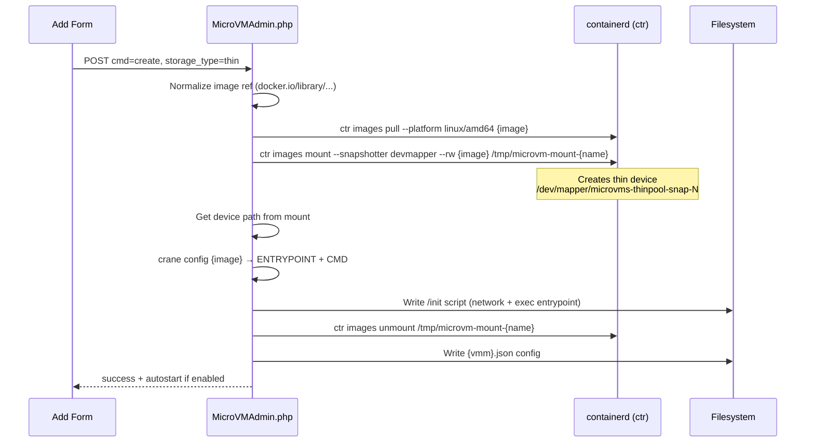
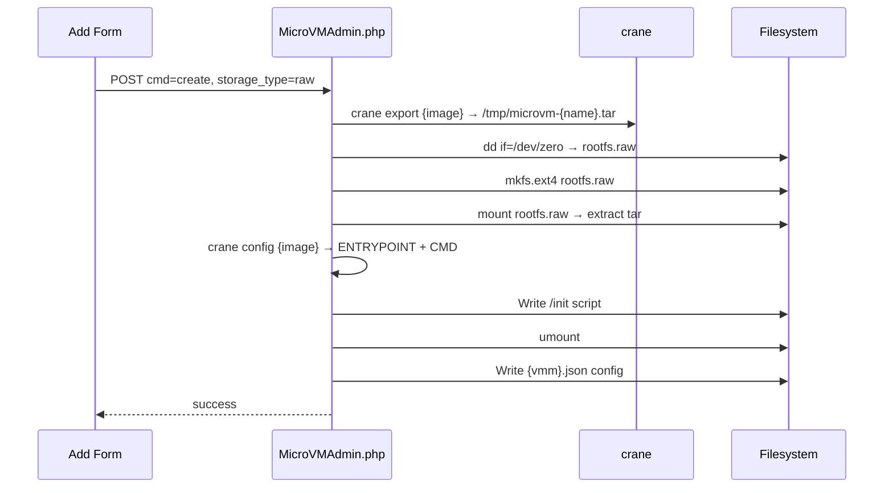
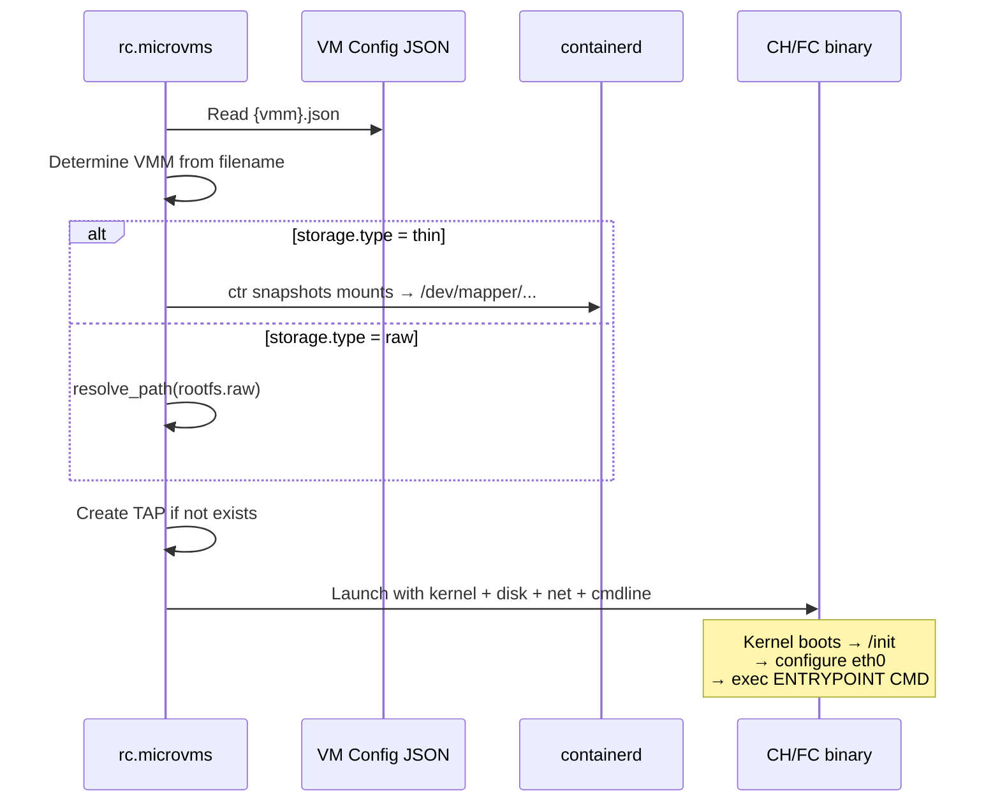
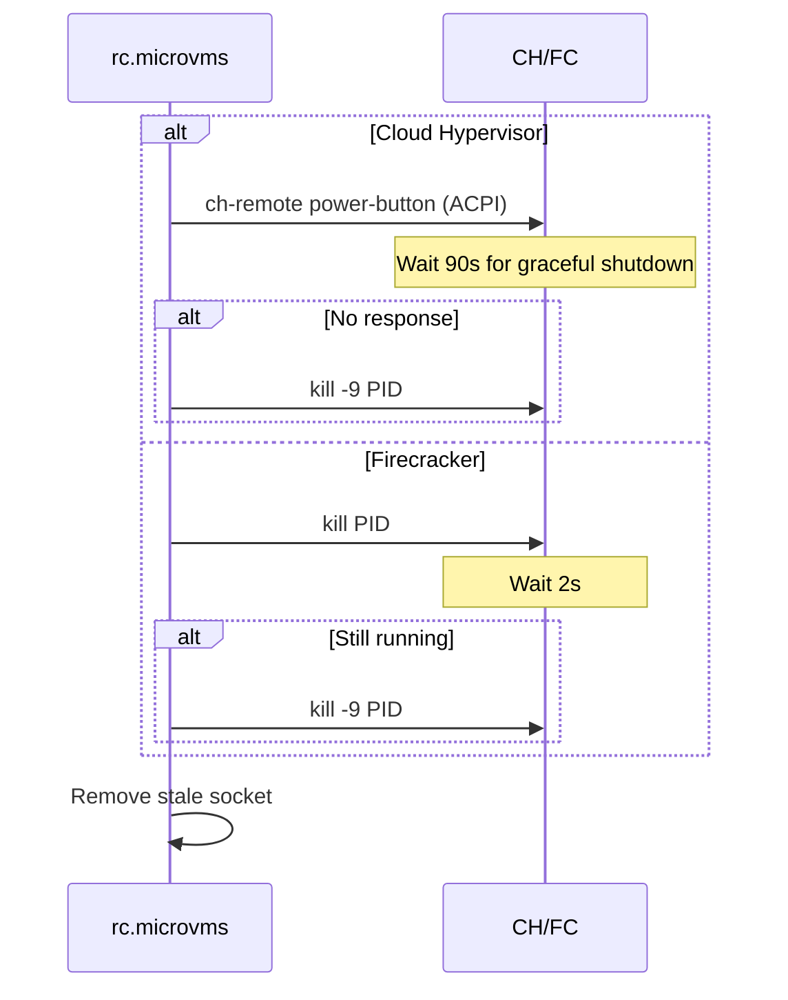
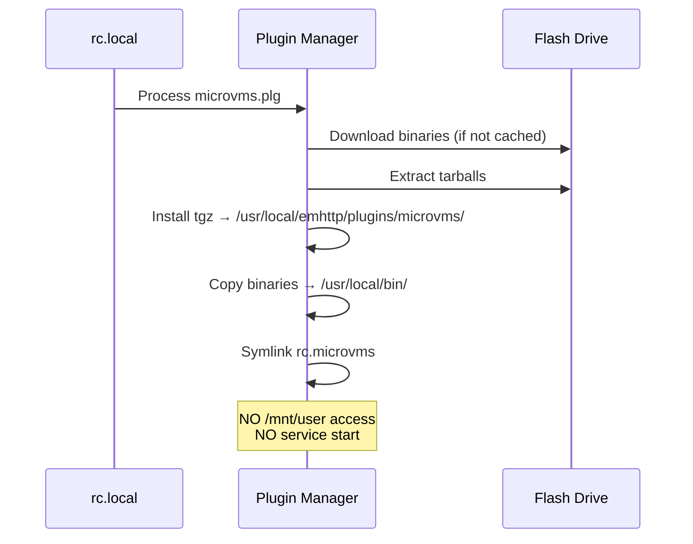
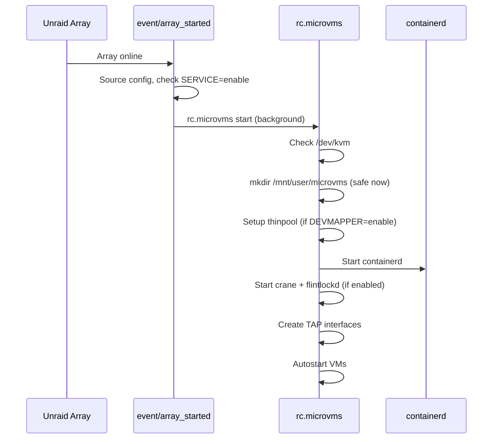

# Workflows

## Create VM (Thin Pool)

```mermaid
sequenceDiagram
    participant UI as Add Form
    participant PHP as MicroVMAdmin.php
    participant CTR as containerd (ctr)
    participant FS as Filesystem

    UI->>PHP: POST cmd=create, storage_type=thin
    PHP->>PHP: Normalize image ref (docker.io/library/...)
    PHP->>CTR: ctr images pull --platform linux/amd64 {image}
    PHP->>CTR: ctr images mount --snapshotter devmapper --rw {image} /tmp/microvm-mount-{name}
    Note over CTR: Creates thin device<br>/dev/mapper/microvms-thinpool-snap-N
    PHP->>PHP: Get device path from mount
    PHP->>PHP: crane config {image} → ENTRYPOINT + CMD
    PHP->>FS: Write /init script (network + exec entrypoint)
    PHP->>CTR: ctr images unmount /tmp/microvm-mount-{name}
    PHP->>FS: Write {vmm}.json config
    PHP-->>UI: success + autostart if enabled
```

## Create VM (Raw rootFS)

```mermaid
sequenceDiagram
    participant UI as Add Form
    participant PHP as MicroVMAdmin.php
    participant CRANE as crane
    participant FS as Filesystem

    UI->>PHP: POST cmd=create, storage_type=raw
    PHP->>CRANE: crane export {image} → /tmp/microvm-{name}.tar
    PHP->>FS: dd if=/dev/zero → rootfs.raw
    PHP->>FS: mkfs.ext4 rootfs.raw
    PHP->>FS: mount rootfs.raw → extract tar
    PHP->>PHP: crane config {image} → ENTRYPOINT + CMD
    PHP->>FS: Write /init script
    PHP->>FS: umount
    PHP->>FS: Write {vmm}.json config
    PHP-->>UI: success
```

## Start VM

```mermaid
sequenceDiagram
    participant RC as rc.microvms
    participant CFG as VM Config JSON
    participant CTR as containerd
    participant VMM as CH/FC binary

    RC->>CFG: Read {vmm}.json
    RC->>RC: Determine VMM from filename
    alt storage.type = thin
        RC->>CTR: ctr snapshots mounts → /dev/mapper/...
    else storage.type = raw
        RC->>RC: resolve_path(rootfs.raw)
    end
    RC->>RC: Create TAP if not exists
    RC->>VMM: Launch with kernel + disk + net + cmdline
    Note over VMM: Kernel boots → /init<br>→ configure eth0<br>→ exec ENTRYPOINT CMD
```

## Stop VM

```mermaid
sequenceDiagram
    participant RC as rc.microvms
    participant VMM as CH/FC

    alt Cloud Hypervisor
        RC->>VMM: ch-remote power-button (ACPI)
        Note over VMM: Wait 90s for graceful shutdown
        alt No response
            RC->>VMM: kill -9 PID
        end
    else Firecracker
        RC->>VMM: kill PID
        Note over VMM: Wait 2s
        alt Still running
            RC->>VMM: kill -9 PID
        end
    end
    RC->>RC: Remove stale socket
```

## Plugin Install (Boot)

```mermaid
sequenceDiagram
    participant BOOT as rc.local
    participant PLG as Plugin Manager
    participant FLASH as Flash Drive

    BOOT->>PLG: Process microvms.plg
    PLG->>FLASH: Download binaries (if not cached)
    PLG->>FLASH: Extract tarballs
    PLG->>PLG: Install tgz → /usr/local/emhttp/plugins/microvms/
    PLG->>PLG: Copy binaries → /usr/local/bin/
    PLG->>PLG: Symlink rc.microvms
    Note over PLG: NO /mnt/user access<br>NO service start
```

## Array Start (Event)

```mermaid
sequenceDiagram
    participant ARRAY as Unraid Array
    participant EVENT as event/array_started
    participant RC as rc.microvms
    participant CTD as containerd

    ARRAY->>EVENT: Array online
    EVENT->>EVENT: Source config, check SERVICE=enable
    EVENT->>RC: rc.microvms start (background)
    RC->>RC: Check /dev/kvm
    RC->>RC: mkdir /mnt/user/microvms (safe now)
    RC->>RC: Setup thinpool (if DEVMAPPER=enable)
    RC->>CTD: Start containerd
    RC->>RC: Start crane + flintlockd (if enabled)
    RC->>RC: Create TAP interfaces
    RC->>RC: Autostart VMs
```
