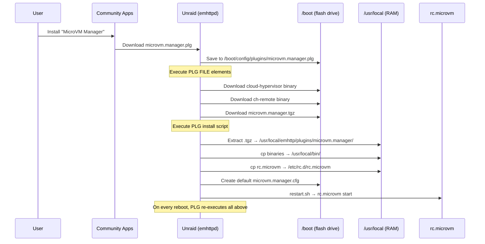
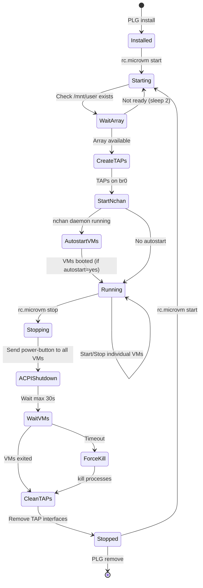
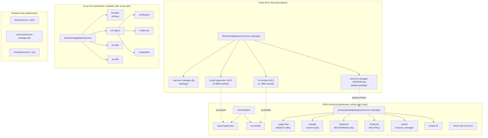
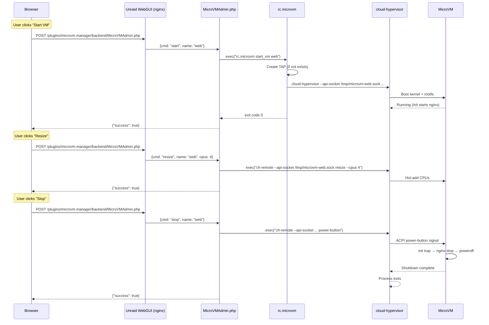
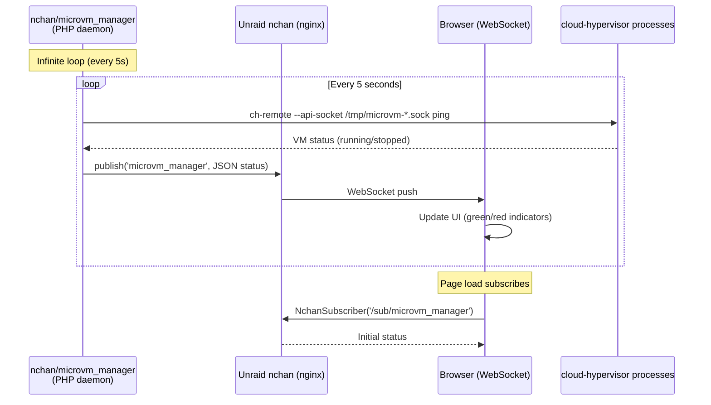
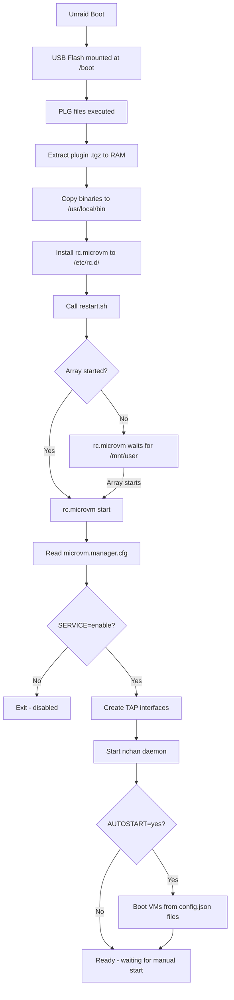
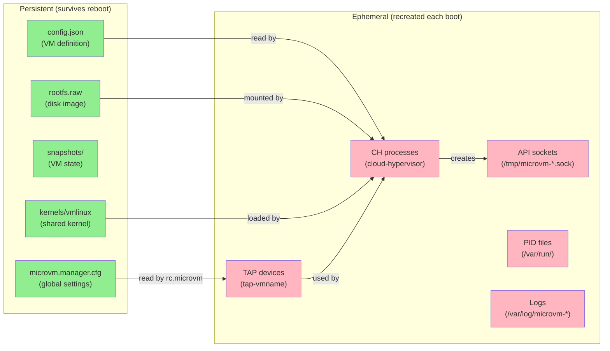

# Service Architecture Diagrams

## Comparison: Tailscale vs ZFS Master Patterns

| Aspect | Tailscale (Official) | ZFS Master (Community) |
|--------|---------------------|------------------------|
| Real-time updates | Watcher daemon + AJAX polling | Nchan WebSocket push |
| Service management | rc.d script + restart.sh | No daemon |
| PHP structure | OOP namespaced classes | Flat procedural |
| State tracking | JSON files + LocalAPI calls | Shell exec + parse |
| Frontend | jQuery AJAX `$.post()` | NchanSubscriber WebSocket |
| Packaging | Slackware .txz + binary .tgz | Single .tgz of folder |

**For MicroVM Manager: Use ZFS Master's nchan pattern** (WebSocket push is better UX for VM status that changes frequently), combined with Tailscale's rc.d service management pattern.

---

## 1. Plugin Installation Flow



## 2. Service Lifecycle



## 3. Folder Structure



## 4. Request Flow (User → VM Action)



## 5. Nchan Real-Time Updates (ZFS Master pattern)



```javascript
// Frontend subscription (in .page file)
var microvm_sub = new NchanSubscriber('/sub/microvm_manager', {subscriber: 'websocket'});
microvm_sub.on('message', function(data) {
    var status = JSON.parse(data);
    updateVMTable(status);  // Update UI
});
microvm_sub.start();
```

## 6. Settings Page Flow

```mermaid
sequenceDiagram
    participant User
    participant Form as Settings Form
    participant Update as /update.php
    participant Flash as /boot/.../microvm.manager.cfg
    participant Restart as restart.sh
    participant RC as rc.microvm

    User->>Form: Change settings + click Apply
    Form->>Update: POST (#file, #command, form fields)
    Update->>Flash: Write key=value to .cfg file
    Update->>Restart: Execute restart.sh
    Restart->>Restart: "sleep 3; rc.microvm restart" | at now
    Restart-->>Update: returns immediately
    Update-->>Form: Show "Applied" in progressFrame

    Note over RC: 3 seconds later...
    RC->>RC: stop (shutdown VMs, remove TAPs)
    RC->>RC: start (create TAPs, start VMs with new config)
```

## 7. Boot Sequence



## 8. VM Data Flow (persistent vs ephemeral)



## 9. Comparison with Tailscale's Watcher Pattern

```mermaid
graph TB
    subgraph "Tailscale Pattern (AJAX Polling)"
        TS_W[tailscale-watcher.php<br/>Infinite loop] -->|calls| TS_API[tailscale CLI/LocalAPI]
        TS_API -->|state| TS_W
        TS_W -->|writes| TS_FILE[JSON state files]
        TS_BROWSER[Browser] -->|$.post every N sec| TS_DATA[data/Status.php]
        TS_DATA -->|reads| TS_FILE
        TS_DATA -->|returns| TS_BROWSER
    end

    subgraph "ZFS Master Pattern (Nchan WebSocket)"
        ZFS_N[nchan/zfs_master<br/>Infinite loop] -->|exec| ZFS_CMD[zfs/zpool commands]
        ZFS_CMD -->|output| ZFS_N
        ZFS_N -->|publish()| NCHAN[Unraid nchan/nginx]
        NCHAN -->|WebSocket push| ZFS_B[Browser]
    end

    subgraph "MicroVM Manager (Recommended: Nchan)"
        MVM_N[nchan/microvm_manager<br/>Infinite loop] -->|exec| MVM_CH[ch-remote ping/info]
        MVM_CH -->|status JSON| MVM_N
        MVM_N -->|publish()| MVM_NCHAN[Unraid nchan/nginx]
        MVM_NCHAN -->|WebSocket push| MVM_B[Browser]
    end
```

**Why Nchan for MicroVM Manager:**
- VMs change state frequently (boot/shutdown in seconds)
- WebSocket = instant UI update (no polling delay)
- ZFS Master proves it works well for this pattern
- Docker manager also uses nchan for container status
- Tailscale's polling pattern is fine for its use case (status rarely changes) but too slow for VMs
